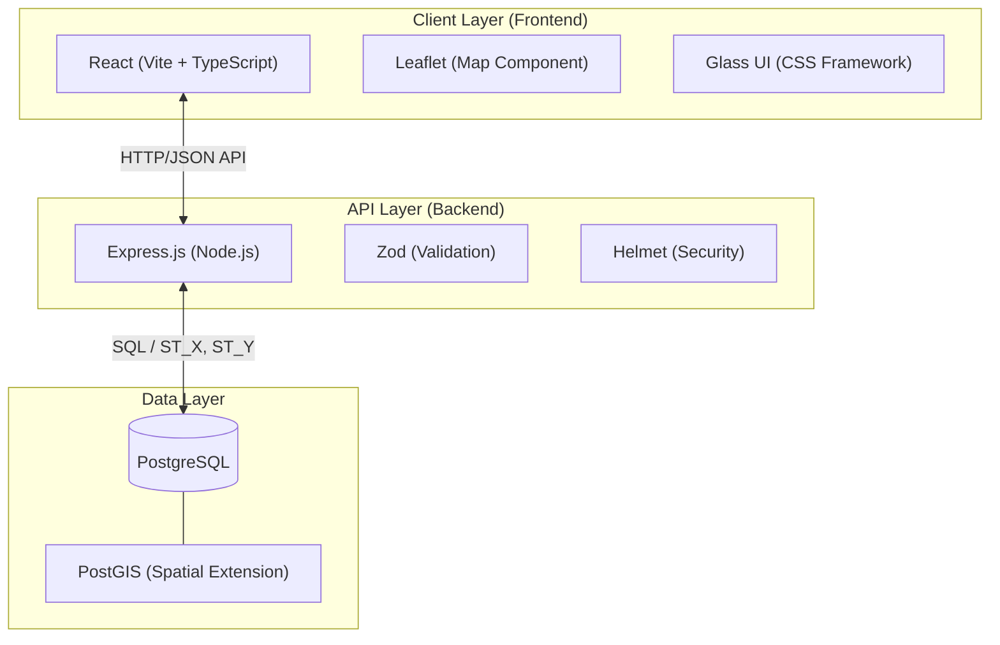
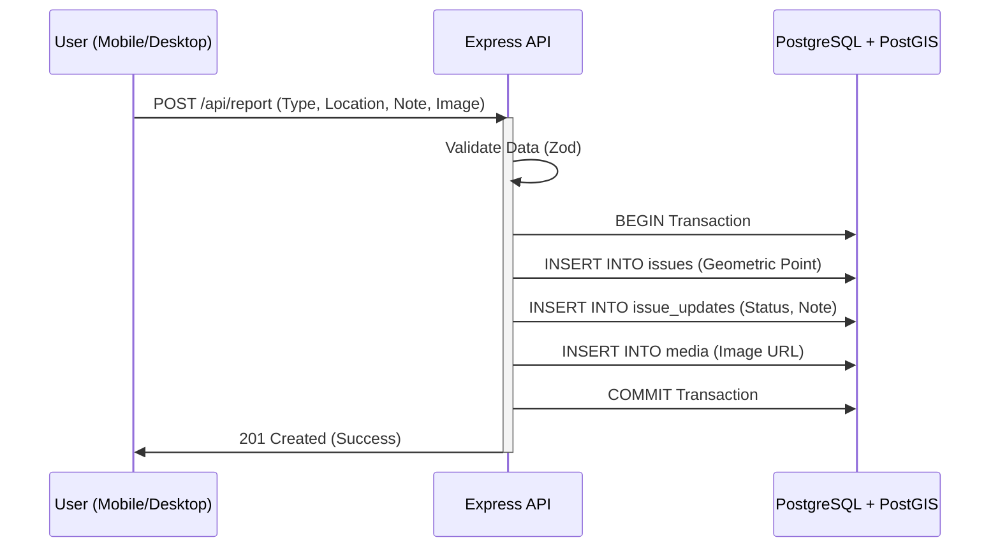
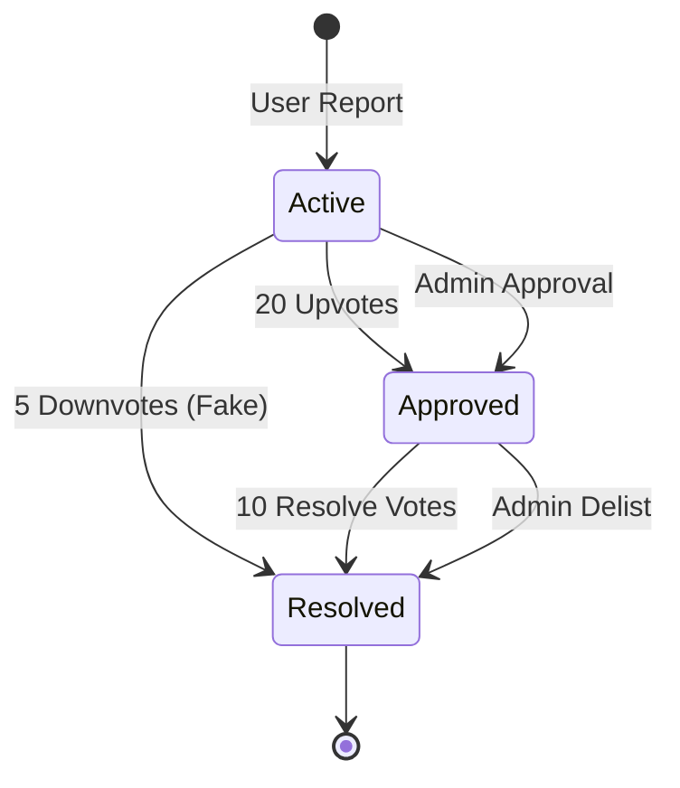

# InfraFlux System Design

This document provides a top-down view of the **InfraFlux** architecture, technology stack, and core data flows.

## High-Level Architecture

The system follows a classic **Client-Server-Database** architecture, optimized for geospatial data visualization.

---

## Core Data Flow: Issue Reporting

When a user reports an issue (e.g., a pothole), the system handles it through a transaction-safe flow.

---

## Feature Intelligence: Growth & Resolution

InfraFlux uses community-driven logic to maintain map accuracy.

### Voting Logic
- **Upvotes**: If a report receives **20 upvotes**, it is automatically marked as **Approved**.
- **Downvotes**: If a report receives **5 downvotes**, it is automatically marked as **Resolved (Fake Report)** and disappears from main view.
- **Resolution**: If an approved issue receives **10 resolve-votes**, it is marked as **Resolved**.

---

## Tech Stack Summary

| Layer | Technology | Key Usage |
| :--- | :--- | :--- |
| **Frontend** | React, TypeScript | Composable UI, Type Safety |
| **State Management** | React Hooks | `useState`, `useEffect` for Map/API state |
| **Maps** | Leaflet | Interactive geospatial visualization |
| **Backend** | Node.js, Express | RESTful API endpoints |
| **Database** | PostgreSQL | Relational data persistence |
| **Spatial** | PostGIS | `GEOMETRY` types, `ST_Distance`, `ST_MakePoint` |
| **Validation** | Zod | Runtime schema validation for API inputs |
| **Styling** | Vanilla CSS | Custom Glassmorphism UI tokens |
