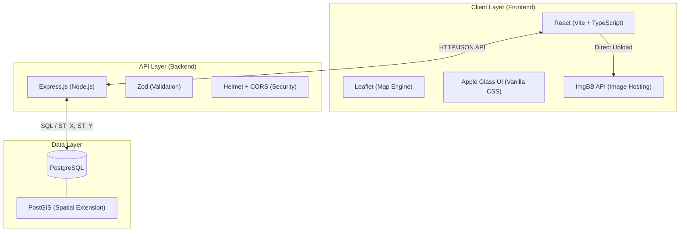
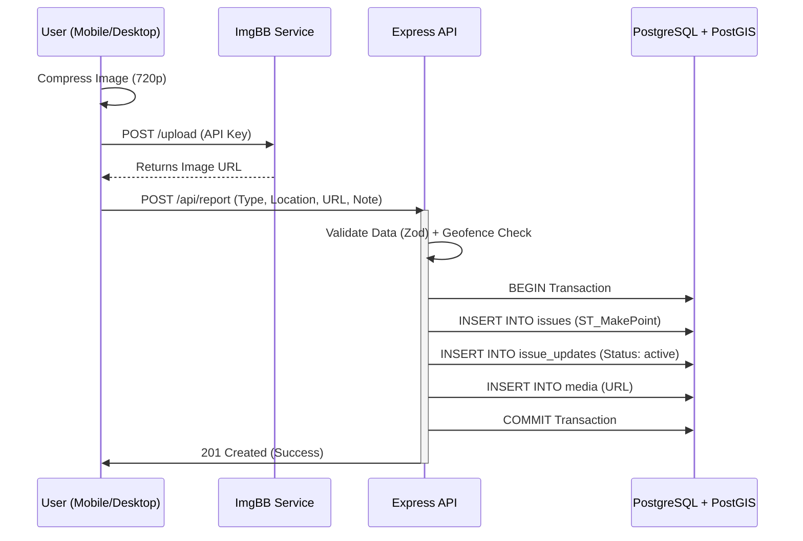
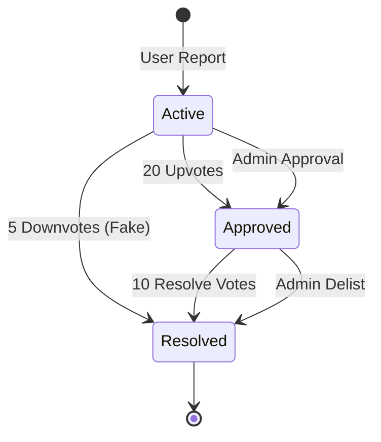

# InfraFlux System Design

This document provides a top-down view of the **InfraFlux** architecture, technology stack, and core data flows.

## High-Level Architecture

The system follows a classic **Client-Server-Database** architecture, optimized for geospatial data visualization and community-driven maintenance.

```mermaid
graph TD
    subgraph "Client Layer (Frontend)"
        A["React (Vite + TypeScript)"]
        B["Leaflet (Map Engine)"]
        C["Apple Glass UI (Vanilla CSS)"]
        D["ImgBB API (Image Hosting)"]
    end

    subgraph "API Layer (Backend)"
        E["Express.js (Node.js)"]
        F["Zod (Validation)"]
        G["Helmet + CORS (Security)"]
    end

    subgraph "Data Layer"
        H[("PostgreSQL")]
        I["PostGIS (Spatial Extension)"]
    end

    A <-->|HTTP/JSON API| E
    E <-->|SQL / ST_X, ST_Y| H
    H --- I
    A -->|Direct Upload| D
```

---

## Core Data Flow: Issue Reporting

When a user reports an issue, the system handles it through a transaction-safe flow with local media optimization.

```mermaid
sequenceDiagram
    participant User as User (Mobile/Desktop)
    participant Img as ImgBB Service
    participant API as Express API
    participant DB as PostgreSQL + PostGIS

    User->>User: Compress Image (720p)
    User->>Img: POST /upload (API Key)
    Img-->>User: Returns Image URL
    User->>API: POST /api/report (Type, Location, URL, Note)
    activate API
    API->>API: Validate Data (Zod) + Geofence Check
    API->>DB: BEGIN Transaction
    API->>DB: INSERT INTO issues (ST_MakePoint)
    API->>DB: INSERT INTO issue_updates (Status: active)
    API->>DB: INSERT INTO media (URL)
    API->>DB: COMMIT Transaction
    API->>User: 201 Created (Success)
    deactivate API
```

---

## Feature Intelligence: Growth & Resolution

InfraFlux uses community-driven logic to maintain map accuracy.

### Community Thresholds
- **Auto-Approval**: If a report receives **20 upvotes**, it is pinned as "Approved".
- **Auto-Delisting**: If a report receives **5 downvotes**, it is hidden as a "Fake Report".
- **Auto-Resolution**: If an approved issue receives **10 resolve-votes**, it is marked as "Resolved".

```mermaid
stateDiagram-v2
    [*] --> Active: User Report
    Active --> Approved: 20 Upvotes
    Active --> Resolved: 5 Downvotes (Fake)
    Approved --> Resolved: 10 Resolve Votes
    Approved --> Resolved: Admin Delist
    Active --> Approved: Admin Approval
    Resolved --> [*]
```

---

## Technical Design Decisions

### 1. Mapping Provider
Switched from Stadia Maps to **CartoDB** (Voyager/Dark Matter) to support custom domains with no-cost tile usage and consistent dark mode visual styling.

### 2. Media Strategy
Offloaded image storage to **ImgBB** to reduce database blob storage and improve asset delivery speed via CDN. Images are locally compressed to 720p before transmission.

### 3. Mobile Navigation
Implemented **Vaul** for gesture-driven bottom sheets. Solved the "scroll-to-drag" handoff conflict by disabling internal container scrolling in CSS and relying on the `MobileBottomPanel`'s primary scroll wrapper.

---

## Tech Stack Summary

| Layer | Technology | Key Usage |
| :--- | :--- | :--- |
| **Frontend** | React, TypeScript | Main Application logic |
| **Maps** | Leaflet, React-Leaflet | Map rendering and marker scaling |
| **Styling** | Vanilla CSS | Apple Glassmorphism Design System |
| **Media** | ImgBB | CDN-backed image hosting |
| **Backend** | Node.js, Express | RESTful API Layer |
| **Database** | PostgreSQL | Relational and Spatial data |
| **Spatial Engine** | PostGIS | ST_X, ST_Y, ST_Distance, ST_SetSRID |
| **Validation** | Zod | End-to-end type safety for API inputs |

